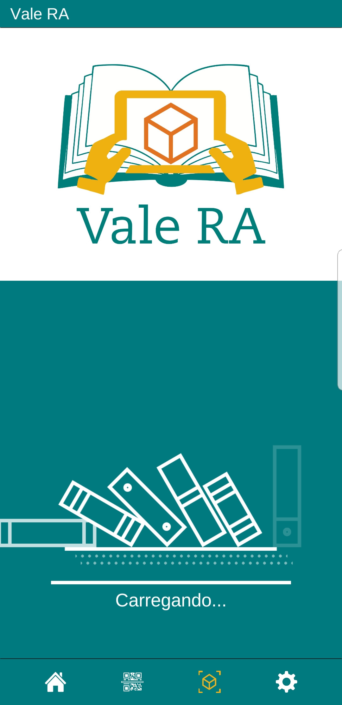
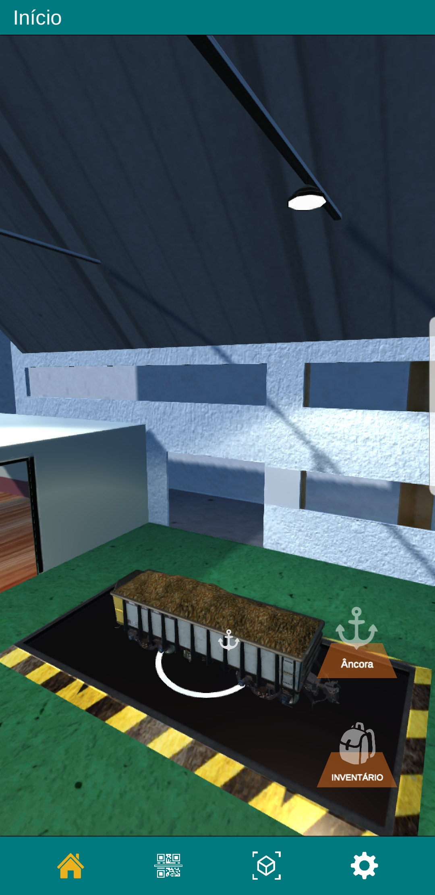
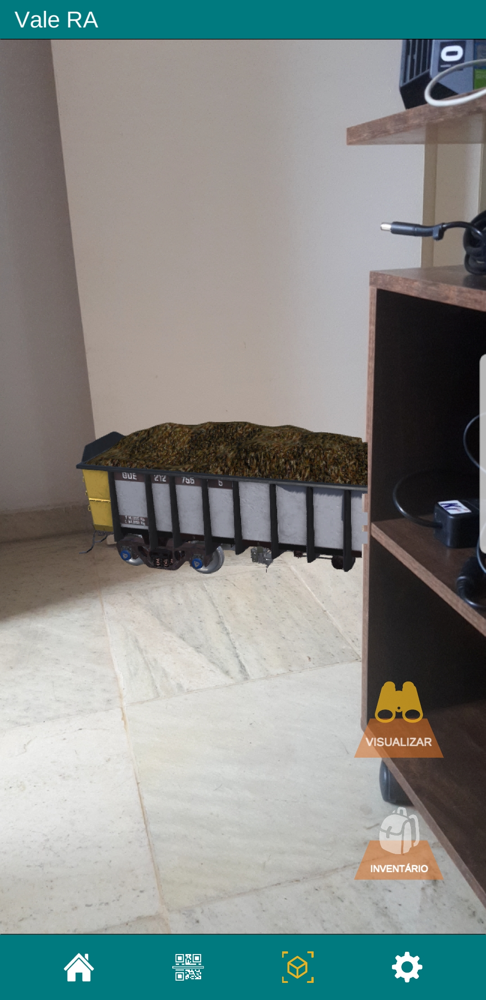
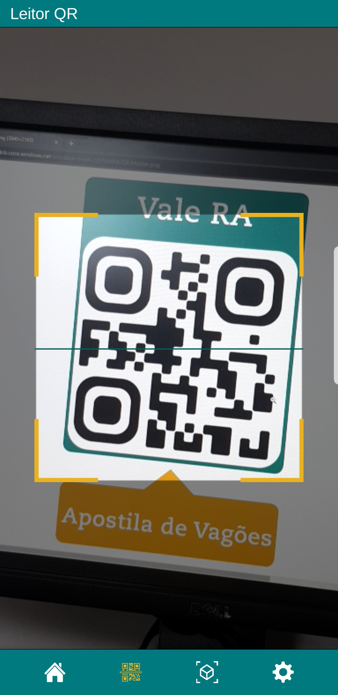

# 📱 Vale RA

**Vale RA** is a mobile application for visualizing 3D models in augmented reality, developed to support technical training and knowledge dissemination within Vale S.A.

> ⚙️ **Recommended Unity Version:** `2019.3.11f1`

---

## 🎯 Purpose

Vale RA was created to:

- ✅ Introduce emerging technologies like **augmented reality** into Vale’s ecosystem
- ✅ Support **practical training and distance learning**
- ✅ Improve **spatial understanding** via immersive 3D visualizations
- ✅ Provide fast, intuitive access to **technical information in the field**

---

## 🚧 Problems Addressed

- Lack of **take-home access** to hands-on training content
- Inability to bring large or complex **equipment into classrooms**
- Absence of **visual materials** that convey spatial relationships clearly
- Difficulty in accessing and understanding **technical procedures on-site**

---

## ⚙️ Technical Overview

- Built in **Unity** using the **MVC architecture** accordingly to Vale IT standards
- Cross-platform: supports both **Android** and **iOS** (via a single codebase)
- Uses **Asset Bundles** to download models at runtime
- Model packages are delivered using **QR codes**, scanned directly within the app

> ⚠️ **Note:** Asset Bundle files are **not included** in this repository. To obtain them, contact the author.

---

## 📥 How to Use

1. Download the app from the Play Store
2. Open it and scan one of the provided QR codes to load a 3D model
3. Explore, rotate, zoom, and interact with the model in **augmented reality**

---

## 🖼️ Screenshots

| loading | Home Screen | Model View | QR Scan Mode |
|-------------|-------------|------------|--------------|
| |  |  |  |
